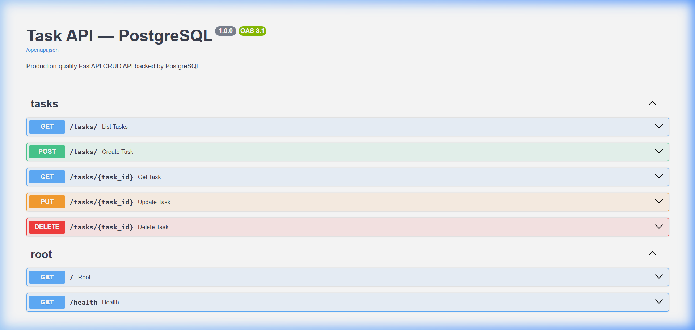
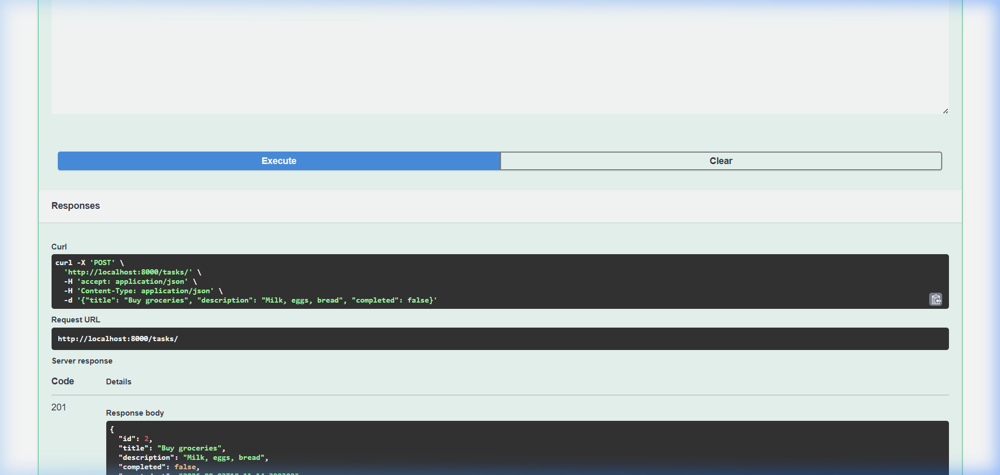
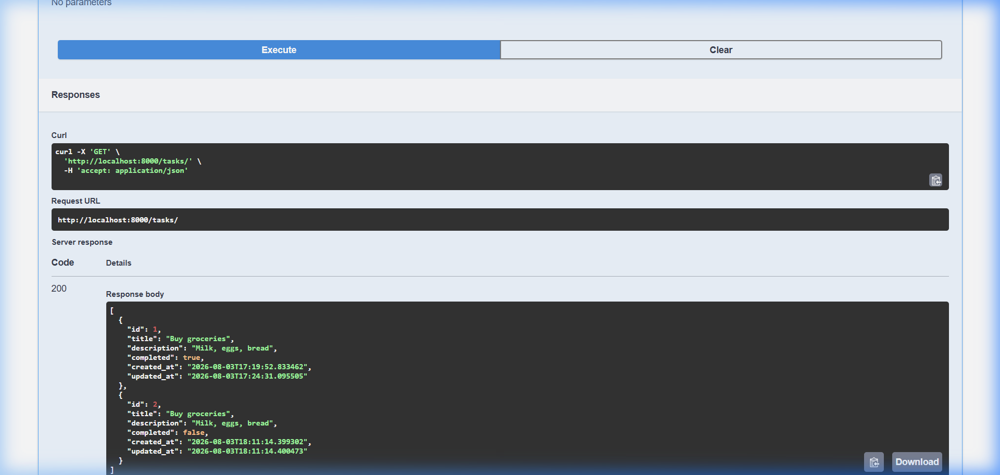
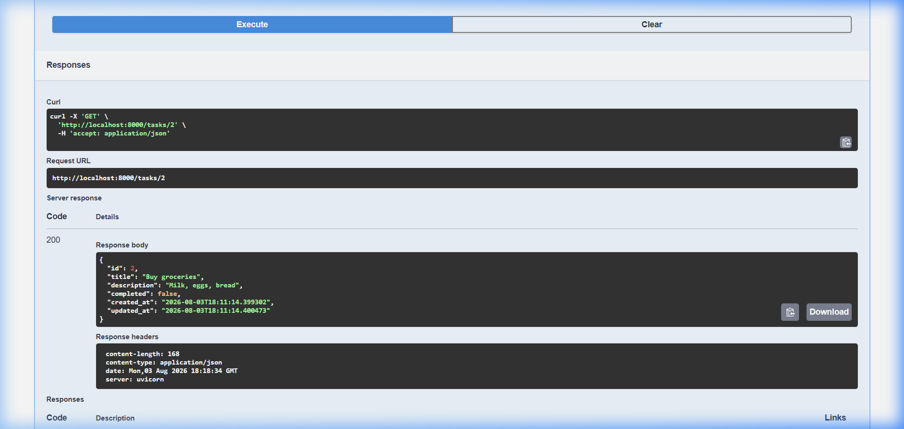
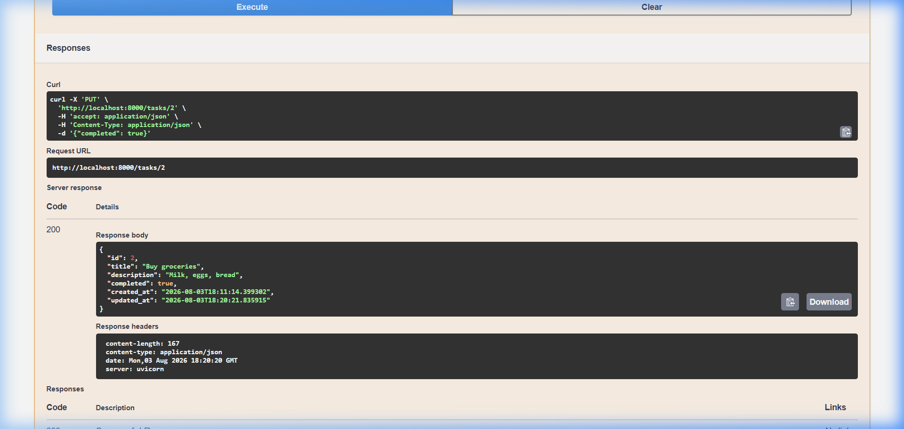
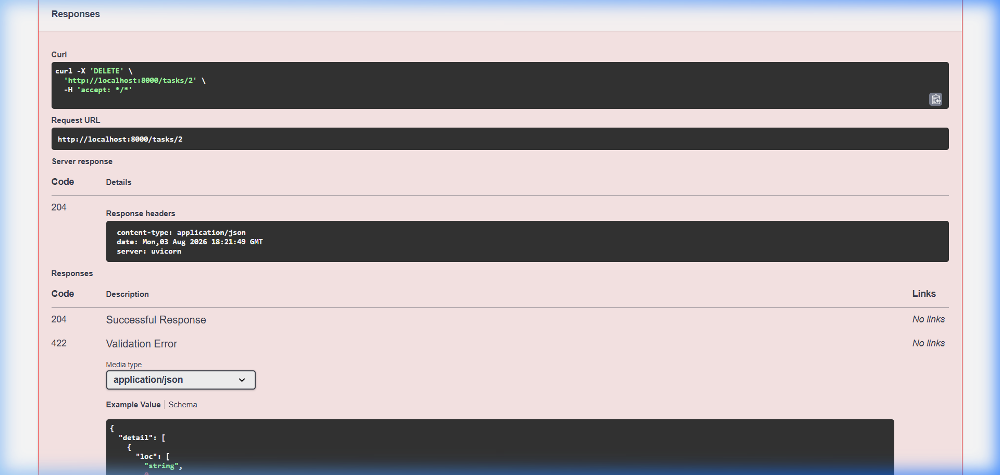

# task-api-postgres

A production-quality **FastAPI CRUD API** backed by **PostgreSQL**, containerised with **Docker Compose**.  
Built for the FlyRank Backend AI Engineering assignment.

---

## Project Overview

This service exposes a RESTful CRUD API for managing **Tasks**. It uses:

- **FastAPI** for routing and validation  
- **SQLModel** as the ORM (built on SQLAlchemy + Pydantic v2)  
- **PostgreSQL 16** as the database  
- **Alembic** for schema migrations  
- **Docker Compose** for one-command local deployment  
- **pytest** + **httpx** for a full unit-test suite (no Docker required for tests)

On every container start, the `entrypoint.sh` script automatically waits for PostgreSQL to be ready and then runs `alembic upgrade head` before serving traffic.

---

## Tech Stack

| Layer       | Technology               |
|-------------|--------------------------|
| Language    | Python 3.12              |
| Framework   | FastAPI                  |
| ORM         | SQLModel                 |
| Database    | PostgreSQL 16            |
| Driver      | psycopg v3 (binary)      |
| Migrations  | Alembic                  |
| Validation  | Pydantic v2              |
| Server      | Uvicorn                  |
| Containers  | Docker + Docker Compose  |
| Testing     | pytest + httpx           |

---

## Folder Structure

```
task-api-postgres/
├── app/
│   ├── __init__.py
│   ├── main.py          # FastAPI application & lifespan
│   ├── database.py      # Engine, session factory
│   ├── models.py        # SQLModel ORM model (Task)
│   ├── schemas.py       # Pydantic request/response schemas
│   ├── crud.py          # DB helper functions
│   ├── dependencies.py  # FastAPI dependencies (session, 404)
│   └── router.py        # APIRouter — all /tasks endpoints
├── alembic/
│   ├── env.py
│   ├── script.py.mako
│   └── versions/
│       └── 622fc42886c8_create_tasks_table.py
├── tests/
│   ├── __init__.py
│   ├── conftest.py      # pytest fixtures (in-memory SQLite override)
│   ├── test_read.py     # Tests for GET endpoints
│   └── test_write.py    # Tests for POST / PUT / DELETE endpoints
├── Dockerfile
├── docker-compose.yml
├── entrypoint.sh        # wait → migrate → serve
├── alembic.ini
├── requirements.txt
├── .env.example
├── .dockerignore
└── .gitignore
```

---

## Environment Variables

Copy `.env.example` to `.env` before running:

```bash
cp .env.example .env
```

| Variable            | Default                                                | Description               |
|---------------------|--------------------------------------------------------|---------------------------|
| `DATABASE_URL`      | `postgresql+psycopg://postgres:postgres@db:5432/tasks` | Full SQLAlchemy DSN        |
| `POSTGRES_USER`     | `postgres`                                             | PostgreSQL superuser name  |
| `POSTGRES_PASSWORD` | `postgres`                                             | PostgreSQL password        |
| `POSTGRES_DB`       | `tasks`                                                | Database name              |

> **Note:** All variables have safe defaults in `docker-compose.yml` so the stack starts even without a `.env` file.

---

## Installation (local, without Docker)

```bash
# Create and activate a virtual environment
python -m venv .venv

# Windows
.venv\Scripts\activate
# macOS / Linux
source .venv/bin/activate

# Install dependencies
pip install -r requirements.txt
```

> Tests run locally against an **in-memory SQLite** database — no PostgreSQL needed.

---

## Docker Setup

### 1. Start all services

```bash
docker compose up --build
```

This single command:
1. Builds the API image
2. Starts PostgreSQL and waits for it to pass its healthcheck
3. Runs `alembic upgrade head` automatically inside the API container
4. Starts Uvicorn on port `8000`

### 2. Stop all services

```bash
docker compose down
```

### 3. Stop and wipe the database volume

```bash
docker compose down -v
```

### 4. Rebuild after code changes

```bash
docker compose up --build
```

### 5. View live logs

```bash
docker compose logs -f api
docker compose logs -f db
```

---

## Alembic — Database Migrations

> Migrations run **automatically** on container start via `entrypoint.sh`.  
> Use the commands below only when creating new migrations or managing history manually.

### Generate a new migration (autogenerate from model changes)

```bash
docker compose exec api alembic revision --autogenerate -m "describe your change"
```

### Apply all pending migrations

```bash
docker compose exec api alembic upgrade head
```

### Roll back one revision

```bash
docker compose exec api alembic downgrade -1
```

### View migration history

```bash
docker compose exec api alembic history --verbose
```

### Check current revision

```bash
docker compose exec api alembic current
```

### Current Migrations

| Revision     | Description         |
|--------------|---------------------|
| `622fc42886c8` | create_tasks_table |

---

## API Endpoints

| Method   | Path          | Description                    | Success | Error |
|----------|---------------|--------------------------------|---------|-------|
| `GET`    | `/`           | Root — confirms API is running | `200`   | —     |
| `GET`    | `/health`     | Health check                   | `200`   | —     |
| `GET`    | `/tasks`      | List all tasks                 | `200`   | —     |
| `GET`    | `/tasks/{id}` | Get a single task by ID        | `200`   | `404` |
| `POST`   | `/tasks`      | Create a new task              | `201`   | `422` |
| `PUT`    | `/tasks/{id}` | Update an existing task        | `200`   | `404` `422` |
| `DELETE` | `/tasks/{id}` | Delete a task                  | `204`   | `404` |

### Task Schema

```json
{
  "id":          1,
  "title":       "Buy groceries",
  "description": "Milk, eggs, bread",
  "completed":   false,
  "created_at":  "2024-01-01T10:00:00",
  "updated_at":  "2024-01-01T10:00:00"
}
```

---

## How to Run

```bash
# 1. Clone the repository
git clone <repo-url>
cd task-api-postgres

# 2. Copy environment file
cp .env.example .env

# 3. Start with Docker Compose (builds, migrates, and serves automatically)
docker compose up --build
```

The API will be live at **http://localhost:8000**

---

## Swagger UI

Interactive API documentation is available at:

```
http://localhost:8000/docs
```

ReDoc (alternative docs):

```
http://localhost:8000/redoc
```

---

## Running Tests

Tests use an **in-memory SQLite** database — no Docker or PostgreSQL needed.

```bash
# Install dependencies (if not already done)
pip install -r requirements.txt

# Run all tests
python -m pytest tests/ -v

# Run only read tests
python -m pytest tests/test_read.py -v

# Run only write tests
python -m pytest tests/test_write.py -v
```

Expected output:

```
21 passed in 0.35s
```

---

## Sample curl Commands

```bash
# Root
curl http://localhost:8000/

# Health check
curl http://localhost:8000/health

# List all tasks
curl http://localhost:8000/tasks

# Create a task (minimal)
curl -X POST http://localhost:8000/tasks \
  -H "Content-Type: application/json" \
  -d '{"title": "Buy groceries"}'

# Create a task (full)
curl -X POST http://localhost:8000/tasks \
  -H "Content-Type: application/json" \
  -d '{"title": "Buy groceries", "description": "Milk, eggs, bread", "completed": false}'

# Get task by id
curl http://localhost:8000/tasks/1

# Update task (partial — only changed fields needed)
curl -X PUT http://localhost:8000/tasks/1 \
  -H "Content-Type: application/json" \
  -d '{"completed": true}'

# Update task title
curl -X PUT http://localhost:8000/tasks/1 \
  -H "Content-Type: application/json" \
  -d '{"title": "Buy groceries and coffee"}'

# Delete task
curl -X DELETE http://localhost:8000/tasks/1
```

---

## Screenshots

### Swagger UI — Endpoint List


### POST /tasks — Create Task


### GET /tasks — List All Tasks


### GET /tasks/{id} — Single Task


### PUT /tasks/{id} — Update Task


### DELETE /tasks/{id} — Delete Task


---

## License

MIT
